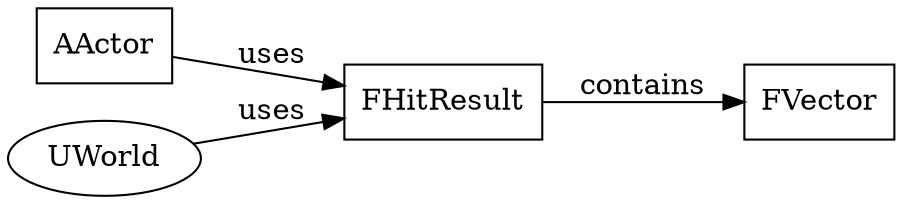

# Phase 5: Relationship Extraction

**Status:** Planning
**Estimated Effort:** 4-6 hours
**Priority:** Medium (Advanced feature)
**Date:** 2025-12-02

---

## Overview

Implement code relationship extraction to understand C++ class hierarchies, composition patterns, and dependencies in the UE5 codebase. This enables queries like:
- "What classes inherit from AActor?"
- "What components does UChaosWheeledVehicleMovementComponent use?"
- "Show me the inheritance hierarchy of FHitResult"

---

## Goals

### Primary Goals
1. **Inheritance Detection**: Parse C++ class/struct inheritance (`class Foo : public Bar`)
2. **Composition Detection**: Identify member variables and their types
3. **Dependency Mapping**: Track includes and type dependencies
4. **Graph Generation**: Build queryable relationship graphs

### Secondary Goals
5. **UE5-Specific Patterns**: Recognize UPROPERTY, UCLASS, component patterns
6. **Virtual Function Detection**: Identify overridden methods
7. **Forward Declaration Handling**: Track forward declarations vs definitions

---

## Current State Analysis

### What We Have
- ✅ Definition extraction (`definition_extractor.py`) - Gets complete struct/class definitions
- ✅ Semantic search - Finds related code chunks
- ✅ Metadata enrichment - Tags entities and macros
- ✅ File path resolution - Knows where code lives

### What We Need
- ❌ Inheritance parser - Extract parent classes
- ❌ Member variable parser - Extract composition relationships
- ❌ Relationship graph builder - Store and query relationships
- ❌ CLI integration - Add `--relationships` argument
- ❌ Output formatting - Display relationship trees

---

## Technical Design

### Architecture

```
User Query "FHitResult relationships"
    ↓
HybridQueryEngine.query_relationships()
    ↓
RelationshipExtractor.extract_relationships()
    ├─→ Parse inheritance (regex patterns)
    ├─→ Parse composition (member variables)
    ├─→ Parse dependencies (includes)
    └─→ Build graph (NetworkX or dict-based)
    ↓
Format output (tree, JSON, or graph)
```

### Data Structures

**Relationship Types:**
```python
class RelationshipType(Enum):
    INHERITS = "inherits"          # Child inherits from Parent
    CONTAINS = "contains"          # Class contains Member
    USES = "uses"                  # Class uses Type (parameter/return)
    DEPENDS_ON = "depends_on"      # File depends on Header
    IMPLEMENTS = "implements"      # Class implements Interface
    OVERRIDES = "overrides"        # Method overrides Virtual
```

**Relationship Graph:**
```python
{
    "FHitResult": {
        "inherits": [],                    # No parent (plain struct)
        "contains": [
            {"name": "ImpactPoint", "type": "FVector"},
            {"name": "ImpactNormal", "type": "FVector"},
            {"name": "Time", "type": "float"}
        ],
        "used_by": ["UWorld", "AActor"],   # Classes that use FHitResult
        "defined_in": "Engine/Source/.../HitResult.h"
    },
    "AActor": {
        "inherits": ["UObject"],
        "contains": [
            {"name": "RootComponent", "type": "USceneComponent*"}
        ],
        "used_by": ["APlayerController", "APawn"],
        "defined_in": "Engine/Source/.../Actor.h"
    }
}
```

---

## Implementation Plan

### Step 1: Create `relationship_extractor.py` (2-3 hours)

**File:** `src/core/relationship_extractor.py` (~400 lines)

**Core Functions:**

```python
class RelationshipExtractor:
    def __init__(self, script_dir: Path):
        self.script_dir = script_dir
        self.graph = {}  # Entity -> Relationships

    def extract_inheritance(self, entity_name: str, definition: str) -> List[str]:
        """
        Extract parent classes from C++ inheritance syntax.

        Patterns to match:
        - class Foo : public Bar
        - class Foo : public Bar, public Baz
        - struct Foo : Bar
        - struct Foo : public Bar, private Baz
        """

    def extract_composition(self, entity_name: str, definition: str) -> List[Dict]:
        """
        Extract member variables and their types.

        Patterns to match:
        - FVector ImpactPoint;
        - UPROPERTY() FVector ImpactPoint;
        - TArray<FName> Tags;
        - USceneComponent* RootComponent;
        """

    def extract_dependencies(self, file_path: str) -> List[str]:
        """
        Extract #include dependencies from file.

        Returns list of included headers.
        """

    def build_relationship_graph(self, entity_name: str) -> Dict:
        """
        Build complete relationship graph for an entity.

        1. Get definition from DefinitionExtractor
        2. Extract inheritance
        3. Extract composition
        4. Extract dependencies
        5. Find usages (reverse lookup)
        6. Return graph dict
        """

    def format_relationship_tree(self, entity_name: str, depth: int = 3) -> str:
        """
        Format relationships as ASCII tree.

        Example output:
        FHitResult
        ├─ Contains:
        │  ├─ ImpactPoint: FVector
        │  ├─ ImpactNormal: FVector
        │  └─ Time: float
        └─ Used by:
           ├─ UWorld::LineTraceSingle()
           └─ AActor::ActorLineTraceSingle()
        """
```

**Regex Patterns:**

```python
# Inheritance patterns
INHERITANCE_PATTERNS = [
    # class Foo : public Bar, private Baz
    r'(?:class|struct)\s+(\w+)\s*:\s*(.+?)\s*\{',

    # Multiple inheritance with access specifiers
    r'(?:public|protected|private)\s+(\w+)',
]

# Member variable patterns
MEMBER_PATTERNS = [
    # UPROPERTY() Type Name;
    r'UPROPERTY\([^)]*\)\s+(\w+(?:<[^>]+>)?(?:\*)?)\s+(\w+)\s*;',

    # Regular members: Type Name;
    r'^\s*(\w+(?:<[^>]+>)?(?:\*)?)\s+(\w+)\s*;\s*$',

    # Pointers and templates
    r'^\s*(T\w+<[^>]+>|\w+\*+)\s+(\w+)\s*;\s*$',
]

# UE5-specific patterns
UE5_COMPONENT_PATTERN = r'U\w*Component\*?\s+(\w+)'
UE5_OBJECT_PATTERN = r'U\w+\*?\s+(\w+)'
```

### Step 2: Integrate with `hybrid_query.py` (30 min)

**Add new method:**

```python
def query_relationships(self, entity_name: str, depth: int = 2) -> Dict:
    """
    Query relationships for a given entity.

    Args:
        entity_name: Entity to query (e.g., "FHitResult", "AActor")
        depth: Relationship traversal depth (1-5)

    Returns:
        Dict with relationship graph and formatted output
    """
    extractor = RelationshipExtractor(self.script_dir)
    graph = extractor.build_relationship_graph(entity_name)
    tree = extractor.format_relationship_tree(entity_name, depth)

    return {
        "entity": entity_name,
        "graph": graph,
        "tree": tree,
        "depth": depth
    }
```

### Step 3: Add CLI Support (30 min)

**Modify `cli_client.py`:**

```python
# Add new argument
parser.add_argument("--relationships", action="store_true",
                   help="Extract and display code relationships")
parser.add_argument("--depth", type=int, default=2,
                   help="Relationship traversal depth (1-5, default: 2)")

# Handle relationships mode
if args.relationships:
    from core.relationship_extractor import RelationshipExtractor

    # Extract entity name from question
    entity_name = extract_entity_name(args.question[0])

    if not entity_name:
        print("[ERROR] Could not detect entity name. Use format: 'FHitResult relationships'")
        return

    # Query relationships
    results = engine.query_relationships(entity_name, depth=args.depth)

    # Format output
    if args.format == "json":
        print(json.dumps(results, indent=2))
    else:
        print(results["tree"])

    return
```

### Step 4: Output Formats (30 min)

**Text Format (ASCII Tree):**
```
FHitResult
├─ Inherits: (none)
├─ Contains (8 members):
│  ├─ FVector ImpactPoint
│  ├─ FVector ImpactNormal
│  ├─ FVector Location
│  ├─ float Time
│  ├─ float Distance
│  ├─ int32 FaceIndex
│  ├─ FName BoneName
│  └─ AActor* Actor
├─ Used by (5 classes):
│  ├─ UWorld::LineTraceSingle()
│  ├─ UWorld::SweepSingle()
│  ├─ AActor::ActorLineTraceSingle()
│  ├─ UPrimitiveComponent::LineTrace()
│  └─ UChaosWheeledVehicleMovementComponent::UpdateWheels()
└─ Defined in: Engine/Source/Runtime/Engine/Public/HitResult.h:42
```

**JSON Format:**
```json
{
  "entity": "FHitResult",
  "inherits": [],
  "contains": [
    {"name": "ImpactPoint", "type": "FVector", "line": 45},
    {"name": "ImpactNormal", "type": "FVector", "line": 48}
  ],
  "used_by": [
    {"class": "UWorld", "method": "LineTraceSingle", "file": "World.h"}
  ],
  "defined_in": {
    "file": "HitResult.h",
    "line": 42,
    "path": "Engine/Source/Runtime/Engine/Public/HitResult.h"
  },
  "depth": 2
}
```

**GraphViz Format (Future):**


### Step 5: Testing (1 hour)

**Test Cases:**

```bash
# Test 1: Simple struct (no inheritance)
ask.bat "FHitResult relationships"

# Test 2: Class with inheritance
ask.bat "AActor relationships" --depth 3

# Test 3: Complex UE5 component
ask.bat "UChaosWheeledVehicleMovementComponent relationships"

# Test 4: JSON output
ask.bat "FVector relationships" --format json

# Test 5: Deep traversal
ask.bat "UObject relationships" --depth 5
```

**Expected Results:**
- All inheritance chains correctly identified
- Member variables parsed with correct types
- UE5 macros (UPROPERTY) handled properly
- Templates (TArray, TMap) parsed correctly
- Pointers recognized

---

## Regex Pattern Details

### Inheritance Parsing

**Pattern 1: Basic Inheritance**
```regex
(?:class|struct)\s+(\w+)\s*:\s*(.+?)\s*\{
```
- Matches: `class Foo : public Bar {`
- Captures: Entity name, inheritance list

**Pattern 2: Multiple Inheritance**
```regex
(?:public|protected|private)\s+(\w+)
```
- Matches each parent in: `public Bar, private Baz`
- Extracts: Access specifier + parent name

**UE5-Specific:**
- Handle `UCLASS()` macro before class
- Handle `Generated_Body()` macro
- Handle `GENERATED_UCLASS_BODY()` macro

### Composition Parsing

**Pattern 1: UPROPERTY Members**
```regex
UPROPERTY\([^)]*\)\s+(\w+(?:<[^>]+>)?(?:\*)?)\s+(\w+)\s*;
```
- Matches: `UPROPERTY() FVector Location;`
- Captures: Type, name

**Pattern 2: Template Types**
```regex
(T\w+<[^>]+>)\s+(\w+)\s*;
```
- Matches: `TArray<FName> Tags;`
- Handles nested templates: `TMap<FString, TArray<int>>`

**Pattern 3: Pointers**
```regex
(\w+\*+)\s+(\w+)\s*;
```
- Matches: `AActor* Actor;`
- Handles multiple indirection: `void**`

### Dependency Parsing

**Include Pattern:**
```regex
#include\s+[<"]([^>"]+)[>"]
```
- Matches: `#include "HitResult.h"`
- Matches: `#include <vector>`

---

## Integration with Existing Features

### With Definition Extractor
- Use existing `extract_definition()` to get full code
- Parse definitions for relationships
- Cache extracted definitions

### With Filtered Search
- Filter by entities that have specific relationships
- Example: `--filter "inherits:UObject"`
- Example: `--filter "contains:FVector"`

### With Batch Processing
- Support batch relationship queries
- JSONL input: `{"question": "FHitResult relationships", "depth": 3}`
- Efficient for building full knowledge graphs

---

##

 Files to Create/Modify

### New Files
1. `src/core/relationship_extractor.py` (~400 lines)
   - Core relationship extraction logic
   - Graph building and traversal
   - Output formatting

2. `tests/test_relationship_extractor.py` (~200 lines)
   - Unit tests for regex patterns
   - Integration tests with real UE5 code

### Modified Files
1. `src/core/hybrid_query.py` (~20 lines added)
   - Add `query_relationships()` method
   - Integrate with RelationshipExtractor

2. `src/utils/cli_client.py` (~30 lines added)
   - Add `--relationships` argument
   - Add `--depth` argument
   - Handle relationship mode

3. `docs/AI_AGENT_GUIDE.md` (~50 lines added)
   - Document relationship queries
   - Add usage examples
   - Add JSON schema

---

## Complexity Assessment

### High Complexity Areas
1. **Regex Pattern Robustness**: C++ syntax is complex
   - Multiple inheritance
   - Template specializations
   - Forward declarations
   - Macro expansions

2. **Graph Traversal**: Circular dependencies
   - A inherits B, B uses A
   - Need cycle detection

3. **Performance**: Large codebases
   - Cache relationship graphs
   - Lazy loading for deep traversals

### Medium Complexity
4. **UE5-Specific Patterns**: UPROPERTY, UFUNCTION, etc.
5. **Output Formatting**: ASCII trees with proper indentation

### Low Complexity
6. **CLI Integration**: Standard argument parsing
7. **JSON Output**: Straightforward serialization

---

## Success Criteria

### Minimum Viable Product (MVP)
- ✅ Parse simple inheritance (`class Foo : public Bar`)
- ✅ Extract basic members (`Type name;`)
- ✅ Display ASCII tree output
- ✅ CLI integration with `--relationships`

### Full Feature Set
- ✅ Multiple inheritance
- ✅ Template types (TArray, TMap, etc.)
- ✅ UE5 macros (UPROPERTY)
- ✅ JSON output format
- ✅ Configurable depth
- ✅ Reverse lookup (what uses this entity?)

### Stretch Goals
- GraphViz output
- Interactive graph exploration (GUI)
- Relationship filtering in searches
- Virtual function override tracking

---

## Timeline

| Task | Duration | Dependencies |
|------|----------|--------------|
| Design & Planning | 30 min | None |
| Create `relationship_extractor.py` | 2-3 hours | None |
| Integrate with `hybrid_query.py` | 30 min | relationship_extractor.py |
| Add CLI support | 30 min | hybrid_query.py |
| Output formatting | 30 min | relationship_extractor.py |
| Testing & debugging | 1 hour | All above |

**Total:** 4-6 hours

---

## Future Enhancements

### Phase 5.1: Advanced Relationships
- Method call graphs
- Data flow analysis
- Dependency injection patterns

### Phase 5.2: Visual Graph Explorer
- GUI tab for relationship visualization
- Interactive node expansion
- Export to GraphViz/Mermaid

### Phase 5.3: Relationship-Based Search
- "Find all classes that use FVector"
- "Show me classes similar to AActor" (by composition)
- "What's the shortest path from A to B?"

---

## Risk Mitigation

### Risk 1: Regex Limitations
**Problem:** C++ parsing is notoriously difficult with regex
**Mitigation:**
- Focus on common patterns (80/20 rule)
- Add preprocessing to normalize code
- Document known limitations
- Consider full parser (libclang) in Phase 5.1

### Risk 2: Performance on Large Graphs
**Problem:** Deep traversals on UE5 codebase could be slow
**Mitigation:**
- Implement caching
- Lazy evaluation
- Limit default depth to 2-3
- Add `--max-results` cap

### Risk 3: Circular Dependencies
**Problem:** A→B→C→A creates infinite loops
**Mitigation:**
- Track visited nodes
- Detect cycles and mark them
- Add cycle detection warning

---

## Conclusion

Phase 5 adds powerful relationship extraction capabilities to the UE5 Source Query System. By parsing inheritance and composition patterns, users can understand code structure beyond simple definitions. This is especially valuable for navigating UE5's complex class hierarchies.

**Key Benefits:**
- Understand class relationships without opening files
- Trace inheritance hierarchies automatically
- Identify composition patterns
- Enable advanced code analysis

**Next Phase:** Phase 6 - Environment Detection (vastly expand auto-detection)
